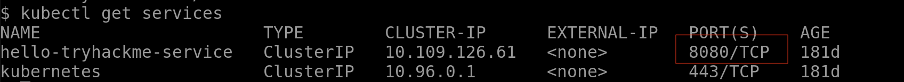

# Virtualization-and-Containers

I completed the Virtualization and Containers course on TryHackMe . Here’s a quick summary of what I learned:

✅ Virtualization: Running multiple virtual machines on a single physical machine to improve efficiency and resource utilization.

✅ Hypervisors: Type 1 (bare metal) and Type 2 (hosted) hypervisors create abstraction layers for virtual machines.

✅ Containers: Share resources with the host OS, making them lightweight, portable, and robust for application deployment.

✅ Docker: Use images built from base images such as Alpine or Ubuntu to create and run containers, with Docker Hub simplifying the sharing and pulling of container images.

✅ Kubernetes: Manage containerized applications by automating scaling, self-healing, and rollouts/rollback, ensuring that applications remain available and responsive even as demand fluctuates.

## Finding the answer to task 2–1

## Finding the answer to task 2–2

## Task2 Correct Answer

## Finding the answer to task 3–1

## Finding the answer to task 3–2

## Task3 Correct Answer

## Finding the answer to task 4

## Task4 Correct Answer

## Finding the answer to task 5

## Task5 Correct Answer

## Finding the answer to task 6–2

## Finding the answer to task 6–3

## Finding the answer to task 6–4

## Finding the answer to task 6–5

## Finding the answer to task 6–6

## Finding the answer to task 6–7

## Finding the answer to task 6–8

## Finding the answer to task 6–9

## Task6 part 1 correct answer

## Task6 part 2 correct answer

## All Task Completed

